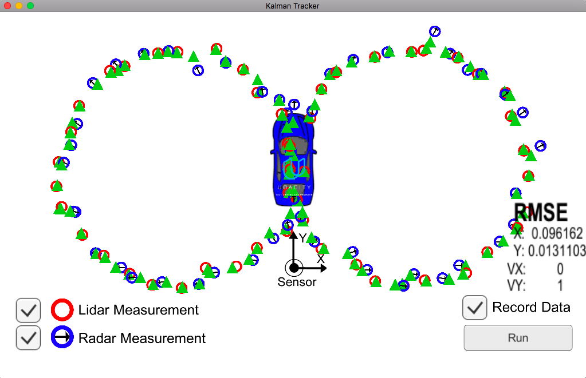

# Project: Combining Laser and Radar Data using Extended Kalman Filter
This is a Sensor Fusion project in Udacity's [Self Driving Car Nanodegree Program](http://udacity.com/drive).

### How to run the project

1. The executable **ExtendedKF** file is present in the Debug folder.
2. The source files are all in the **src** folder, and you can compile them on any system. They should compile without any issues.
3. The input data files are also 

#### Here's an image of the program's output when using the Visualizer:

Ciao!

## (License)
[GNU General Public License](http://choosealicense.com/licenses/gpl-3.0/#)
